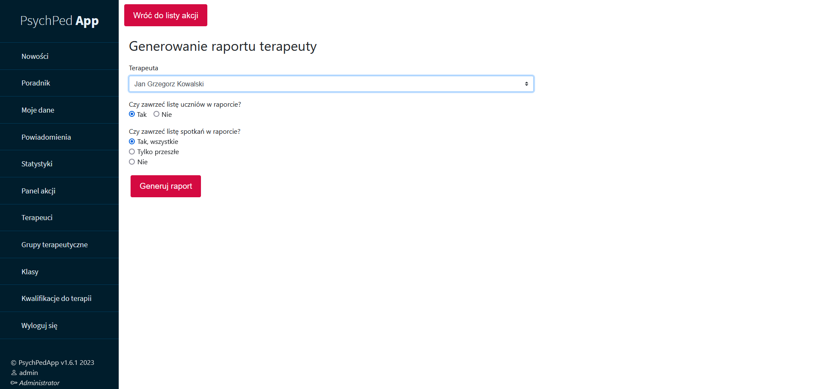

+++
title = 'PsychPed App'
date = 2023-10-01T16:00:00+02:00
+++

PsychPedApp is a bespoke timetabling and online register system for a mental health clinic in Warsaw.

Project is developed together with [Bartosz](https://github.com/ZyndramZM). The software stack is: **Python** with **Flask** library; database is managed with **SQLAlchemy**. It has been deployed and used since September 2022 in production. The production environment is a containerised **FreeBSD** installation with **MySQL** database. The software is maintained and extended as required by the clinic, with latest features added in Summer 2023.

As the project has been done as a bespoke solution, unfortunaltely neither the source, nor the program itself are available. Please contact me if you want to work on some similar open source project or if you need a bespoke solution like this.

## Features

Features of the program include:
* Teacher/psychoterapist accounts with a 3-tier permission system
* Panels that allow granular managment of therapy groups, therapy meetings, therapists, patients
* Integration with a school register
* Management of patients' external documentation 
* Attendance checking
* Extended journal per therapy group, therapy meeting, individual patient's therapy, individual patient
* Management of eligibility and registration to therapy groups
* Automatic paper reports including reports for patient's school teachers, internal record-keeping, patients' parents, clinic's manager.

_Therapist's dashboard_

_Therapy meeting_

_Administration and manager's reports_

_External documentation_

_Journal with notes_

## Related blog posts

