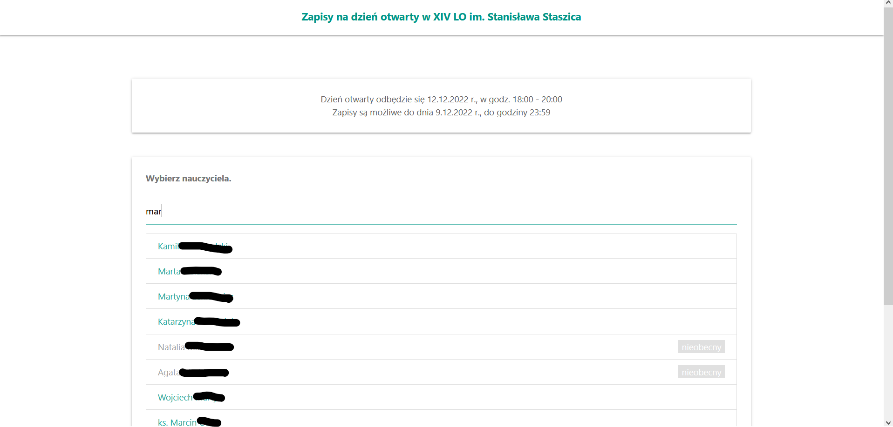
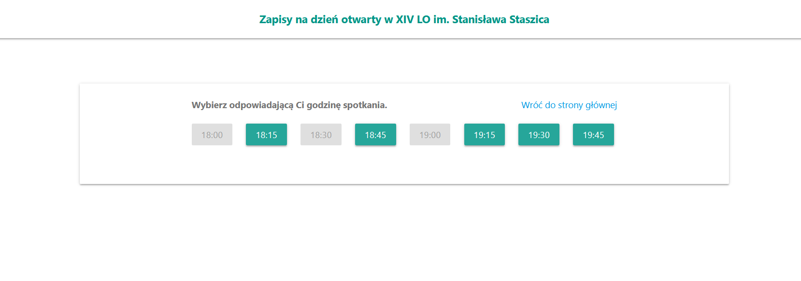
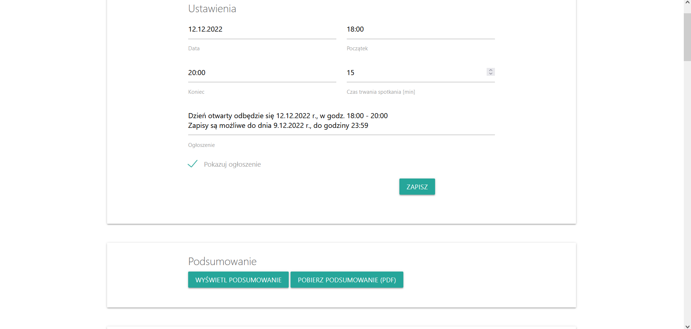

+++
title = 'Staszic Zapisy'
date = 2018-12-01T16:00:00+02:00
draft = false
+++

Staszic-Zapisy is an office hours sign-up system developed for my high school. It has been used in production since early 2019. It was built using **Flask** and **SQLite** as a school group project by [Szymon](https://github.com/szkarpinski), [Olek](https://olus2000.pl/) and myself.

Since we developed it while still in high school, oh dear, my coding style there was not great. The code is not free to use or modify, but its source is available [here](https://github.com/szkarpinski/staszic-zapisy). 

## Features

The features of the system include:
* Ability to sign up to a specific slot of a specific teacher
* E-mail reminder for attendees and teachers, including possibility to cancel an appointment using a link. 
* Printable report with meetings timetable
* Spam prevention using CAPTCHA
* Admin panel

_Choosing a teacher_

_Available slots_

_Admin panel_

